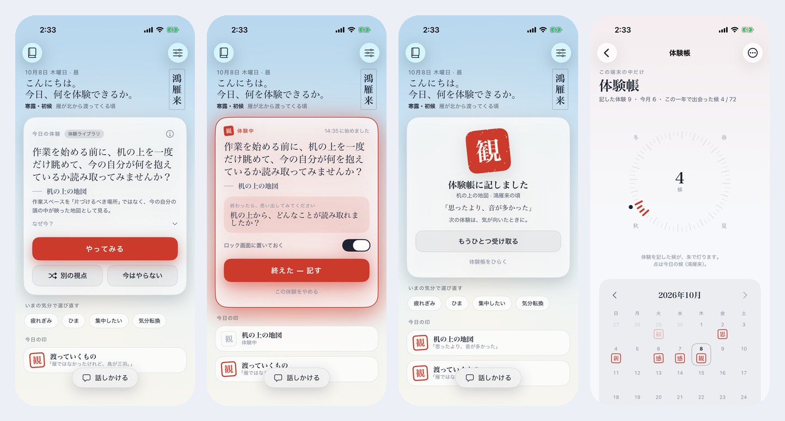
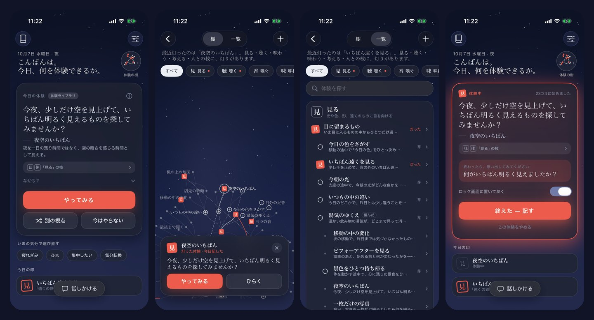

# 体験 — いつもの一日に、まだ見ていない体験がある

> AIが人生を代わりに生きるのではない。体験は、自分で生きて、自分で記すもの。AIは、求めたときにきっかけをひとつ差し出すだけ。

いつもの一日で体験したことを、自分の言葉でひとこと記す。すると、その体験が触れた要素 (見る・聴く・味わう…) に経験が積もり、段が上がるたびに芽が出て、どの見方や力 (技) へ伸ばすかを自分で選べる。そういう **技の樹** を育てる iOS アプリと、その Backend です。
AIや体験ライブラリの提案は、「きっかけをもらう」を押したときだけ出ます。サーバーが無くても、端末の中だけで最後まで使えます (体験ライブラリ / iOS 26 の Apple Intelligence)。

## 体験の流れ

```
いつもの一日を生きる ──▶ 体験を記す ──▶ 経験が積もる ──▶ 段が上がる ──▶ 芽が出る ──▶ 技を伸ばす
                    (自分の言葉で     (触れた要素に    (1, 3, 6, 10 …)  (段ひとつに      (どの技へかは
                     ひとこと)          それぞれ +1)                       芽ひとつ)         自分で選ぶ)
                                                                                              │
                                                       身についた技は、使うほど 守 → 破 → 離 と深まる

きっかけ (求めたときだけ) … AI・体験ライブラリの提案をひとつ。やってみて記せば同じように経験が積もる。断っても、何も減らない
```

## 技の樹

```
     霧 ·  ·                                   閃 … 暮らし方から、ふっと現れる
        ╲ │
 遠目 ── 目を留める ──┐                     ┌── 耳を澄ます ── 遠耳
                     見る ●──────────● 聴く
 色を拾う ── 光と影 ──┘   根 (10の要素)    └── 声の色 ── 言葉の間
                     │                      │
          見立て (見る × 考える の渡り技)    声の奥 (人と × 聴く の渡り技)
```

- **10の要素と93の技**: 見る・聴く・嗅ぐ・味わう・触れる・動く・休む・考える・言葉にする・人と。要素ごとに 一の技3・二の技3・奥義1、要素のあいだに渡り技14、隠れた閃き9 (`contracts/skills.ja.json`)
- **技は「やること」ではなく、身につく見方や力**: 「遠目 — 景色の中のいちばん遠いものに、目が届く。」のように書く。体験ライブラリの94の体験は、技の「稽古」(その技の見方で一日を過ごす入口)。やってもやらなくても、技は減らない
- **経験・段・芽**: 記した体験が触れた要素に経験 +1。段の境目は 1, 3, 6, 10, 15 …。段が上がるたびに芽がひとつ出て、条件のそろった技へ伸ばすと身につく。芽は少なく、選ぶことに意味がある。芽は消えない
- **霧と気配と閃き**: 名前が見えるのは、身についた技の隣だけ。その先は霧。閃きは暮らし方から現れ、条件は画面に出さない
- **守・破・離**: 身についた技は、その技の稽古や「使った」記録が3つで破、7つで離
- **編む・結ぶ**: 自分だけの見方や力に名前をつけて樹に植えられる (伸ばすには芽を使う)。響き合った技どうしを朱の糸で結び、ひとこと添えられる
- **追い立てない**: 経験は時間で減らず、期限・連続記録・他人との比較・達成率は無い。樹は完成しない (編んだ技で、ずっと伸びる)
- **書き出せる**: 要素・技・記した日のページが `[[リンク]]` でつながった Markdown のフォルダとして書き出せる。Obsidian などで開くと、グラフにこの樹が現れる (霧の中の技は書き出さない)

## そのほか

- **光と印**: 地はいまの時刻の空 (夜明け〜深夜の6つの空 × ライト/ダーク)。文字は藍墨。朱は印・身についた技と、「記す」「伸ばす」のような印に値する操作にだけ使う
- **体験帳**: 要素の段、月の暦に押された印、日ごとの記録。記録のページには、その記録で育った技
- **アプリの外にも**: ウィジェット (体験中の体験 / 「体験を記す」の入口)、体験中の Live Activity、ショートカット「体験を記す」、朝の便り (既定オフ・一日一度の短いひとこと)
- **正直さ**: どのしくみがきっかけをつくったか (サーバーのAI / Apple Intelligence / 体験ライブラリ) をカードに出し、「次に渡す内容」を送る前に確かめられる。事実と推測は見た目で分ける。自分で記した体験の言葉は、AIに送らない




iPhone 17 Pro (iOS 26) のシミュレータで、UI テストが体験の流れをたどりながら撮った画面です。ほかの場面は [docs/screenshots](docs/screenshots)。
考え方 (義務と体験・RPG の体験・参照元・原則・言葉づかい) は [docs/DESIGN.md](docs/DESIGN.md)。

## 構成

```
contracts/   API契約 (OpenAPI + フィクスチャ)、体験ライブラリと10の要素 (content.ja.json)、技の樹 (skills.ja.json)、検査と選び方の共通テストケース
backend/     Node.js 22 + TypeScript (実行時の依存なし)。Docker / compose 付き
ios/
  TaikenCore/    UIに依存しない中核 (Swift 6)。ViewModel・技の樹 (設計図・経験と段と芽・閃き・配置)・体験ライブラリ・安全確認・通知判断・傾向計算
  Taiken/        アプリ (SwiftUI・SwiftData・EventKit・Keychain・通知・位置・App Intents・Apple Intelligence)
  TaikenWidgets/ ウィジェットと Live Activity
  Shared/        アプリとウィジェットで共有する見た目と定義
docs/        DESIGN / ARCHITECTURE / SECURITY_PRIVACY / OPERATIONS / screenshots
.github/     CI (Backend・Docker・Swift on Linux・Xcode)、IPA のビルド、画面の流れの UI テスト
```

## インストール

### IPA (署名なし) から

[Actions の IPA ワークフロー](.github/workflows/ipa.yml) が、`main` に push するたびに実機用の `Taiken-<version>-unsigned.ipa` を作ります (Actions の成果物と `ci-results` ブランチ)。
署名されていないので、そのままでは iPhone に入りません。次のどれかで自分の Apple ID で署名して入れます。

- **Sideloadly / AltStore** (Mac / Windows): IPA を読み込み、自分の Apple ID で署名して転送する。無料の Apple ID では7日ごとに入れ直しが必要
- **Xcode から直接** (Mac): 下の「ソースから」の手順で、自分の Team で実機に入れる (ウィジェットの共有まで完全に動くのはこの方法)

> 署名し直すツールは App Group の ID を書き換えることがあります。その場合、アプリは問題なく動きますが、ウィジェットには日付とひとことだけが表示されます。

### ソースから (Xcode 16 以上・Mac)

```bash
brew install xcodegen
cd ios && xcodegen generate && open Taiken.xcodeproj
```

Signing の Team とバンドルIDは `ios/Config/Local.xcconfig` に書きます (gitには入りません)。App Group は `group.<バンドルID>` になります。

```
TAIKEN_DEVELOPMENT_TEAM = ABCDE12345
TAIKEN_BUNDLE_ID = jp.yourname.taiken
```

無料の Apple ID (Personal Team) で「App Groups に対応していない」と署名に失敗するときは、同じファイルに次の2行を足すと App Group なしで入れられます (アプリは動き、ウィジェットには日付とひとことだけが出ます)。

```
TAIKEN_APP_ENTITLEMENTS =
TAIKEN_WIDGET_ENTITLEMENTS =
```

サーバーが無くても、体験ライブラリ (10の要素・94の体験) と技の樹で動きます。iOS 26 以降の Apple Intelligence 対応機種では、端末内のAIがきっかけをつくります。
3.0 から入れ替えると、体験帳はそのまま引き継がれ、はじめて開いたときに、これまでの記録から育っていた段を一度だけ見せます。

## 自分のサーバーのAIを使う (任意)

```bash
cd backend
npm install
npm run start:mock                    # APIキー無しで全体を試す (http://localhost:8787)
```

本番は `backend/.env` に `ANTHROPIC_API_KEY` と `CLIENT_TOKENS` (`npm run token` で作る) を書き、`docker compose up -d --build`。
Tailscale で iPhone からだけ繋がるようにし、アプリの「設定 → 自分のサーバー」で URL とトークンを保存します。手順は [docs/OPERATIONS.md](docs/OPERATIONS.md)。

## 品質の確認

| 対象 | 方法 | 結果 |
|---|---|---|
| Backend | `npm run check`: TypeScript strict の型検査と、テスト110件。カバレッジのしきい値付き | 全件成功 |
| iOS 中核 | `swift test`: Swift 6 言語モード、テスト198件 (技の樹の組み立て・経験と段と芽・閃き・守破離・配置・編む・結ぶ・書き出し・3.0 からの移行を含む)。Linux と macOS の両方 | 全件成功 |
| 契約 | Backend と iOS が同じ `contracts/` を検証。Backend は実際の出力も OpenAPI で検証 | 一致 |
| 体験ライブラリと技の樹 | `contracts/content.ja.json` と `skills.ja.json` を正として iOS・Backend にコピーし、一致を確認。`check_content.py` がつながり・根・季節の言葉を、`check_skills.py` が技の形・先の技・稽古・名前・言葉の約束を確かめる。選び方は Python の基準実装から作った16ケースを、Swift・TypeScript が同じ結果で通る | 一致 |
| アプリ層 | `TaikenTests` をシミュレータで: SwiftData の保存と v1 / v2 → v3 移行 (体験帳が失われず、古い記録も樹の上の位置が見つかる)、ディープリンク、依存の組み立て、見本の樹 (身についた技・編んだ技・結び)、Markdown の書き出し、Keychain (署名なしの CI では省略) | 全件成功 |
| 画面の流れ | `TaikenUITests` をシミュレータ (iOS 26) で、ライト表示・ダーク表示の2回: はじめの案内 → ホーム (自分の樹) → 体験を記す → 印と経験 → きっかけをもらう → 手がかり → 技の樹 (芽・一覧・技のページ・伸ばす・編む) → やってみる → 思い返して記す → 印 → 体験帳 → 記録 → 話す → 設定。各場面を撮影 (`Screens` ワークフロー) | 全件成功 |
| 実機用ビルド | `IPA` ワークフロー: Xcode 26 / iOS 26 SDK でアプリとウィジェット拡張をビルドし、署名なしの IPA にまとめる | 成功 |
